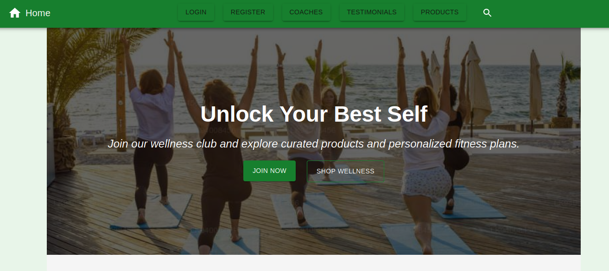

# Wellness website

### Description

This project involves building a wellness website. 

### Features

## Header Navigation
Responsive layout:
- Desktop navigation with full button menu and dropdowns.
- Mobile drawer navigation.
User-based rendering:
  - Shows Login and Register buttons for guests.
  - Shows Profile, Diary, Logout, and Results for logged-in users.
  - Adds Admin section for users with ADMIN role.
Search functionality:
  - Toggles search input with redirect to search page(still working on it as a global search feature)

## Admin Panel

Admins can:
- View and search users
- Filter by role (admin, coach, user)
- Sort users by name or registration date
- Change user roles
- Block/unblock accounts

## Manage Products

Admins can:
- View and search products by name and tag
- Filter by category (supplements, cosmetics)
- Sort products by name, price, newest
- Add new product
- Update product
- Delete product

## Products Page

Users can:
- View and search products by name and tag
- Filter by category (supplements, cosmetics)
- Sort products by name, price, newest
- Load more products
- Scroll-to-top

The page has Skeleton loading that improves UX.
And single product view.

### Code Architecture

**Client-Side Components:**
- The front-end is divided into public, src with reusable components like SearchToolbar, and custom hooks, data, hooks, recoil, service.
  
**Backend Architecture:**
- The back-end contains essential folders like prisma(schema & migrations), config(corsOptions, prismaClient), controllers, middleware, routes, app,js & server.js.

**Docs**
- API Documentation

### Creators

- Zvezda Neycheva - [@DreamersJS](https://github.com/DreamersJS)

### Technologies used

- JavaScript
- React & Recoil
- Tailwind CSS & MUI
- Express.js
- bcrypt 
- JWT
- PostgreSQL & Prisma ORM
- Vitest
- git

### Installation
To get the project running on your local machine, follow these steps:
1. Install dependencies: In the terminal, run the following command in the root, client, and server folders:
```
npm install
```

2. Run the Application: From the root folder, run the following command to start the app:

```
npm run dev
```
***Alternatively, you can start the client and server separately by running the same command in the client folder first, then in the server folder.***


### Homepage


